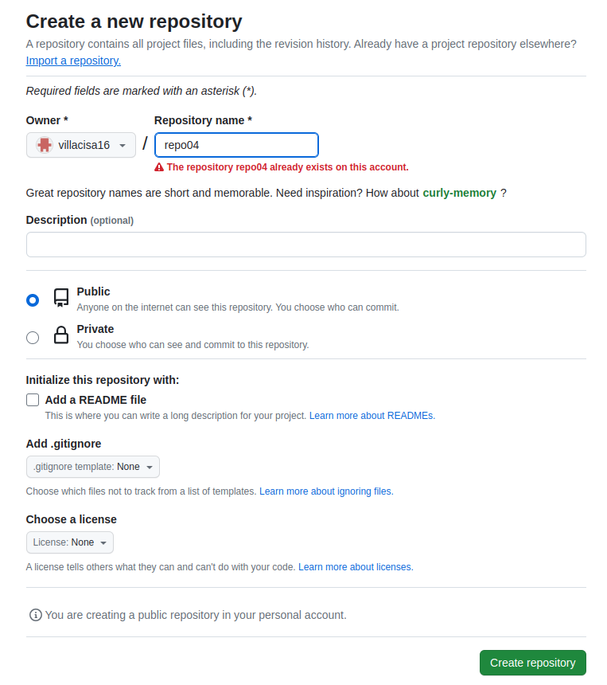
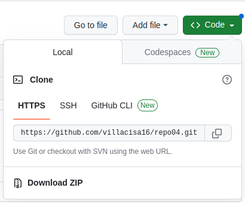

# EJERCICIO 4: FAST FORWARD

**□ 4.1 – Crea un directorio llamado repo04, esta vez tu decides como lo haces. Es decir, tendrás que seleccionar uno de los dos caminos que hemos visto en los dos ejercicios anteriores. Pero si que queremos que exista el repositorio el local y en remoto.**

Primero he creado el repositorio remoto a través de GitHub:

En GitHub encontramos el link del nuestro repositorio para poder clonarlo desde nuestra máquina.

Y desde la terminal, con el comando "git clone", seguido del link, podremos clonar nuestro repositorio remoto y tenerlo tanto en remoto como en local.

**□ 4.3 – Crea una rama con tu nombre y la fecha actual (por ejemplo en mi caso la rama se llamará david02032022) desde la cual editaremos el fichero**