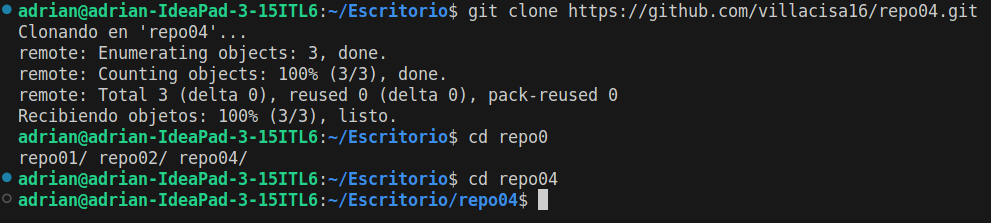

# EJERCICIO 4: FAST FORWARD

**□ 4.1 – Crea un directorio llamado repo04, esta vez tu decides como lo haces. Es decir, tendrás que seleccionar uno de los dos caminos que hemos visto en los dos ejercicios anteriores. Pero si que queremos que exista el repositorio el local y en remoto.**

Primero he creado el repositorio remoto a través de GitHub:

En GitHub encontramos el link del nuestro repositorio para poder clonarlo desde nuestra máquina.

Y desde la terminal, con el comando "git clone", seguido del link, podremos clonar nuestro repositorio remoto y tenerlo tanto en remoto como en local.

**□ 4.3 – Crea una rama con tu nombre y la fecha actual (por ejemplo en mi caso la rama se llamará david02032022) desde la cual editaremos el fichero**

□ 4.4 – Desde tu rama (adrian12092023) edita el fichero readme.md de tal forma que quede de la siguiente
manera:

---
# repo04

Mi primer ejercicio con ramas

Antes de editar debemos situarnos en nuestra rama de la siguiente manera:

tercera versión

**□ 4.5 – Haz 3 commits desde nuestra rama (adrian12092023)**

**□ 4.6 – En el siguiente orden realiza lo siguiente:**

**□ 4.6.1 – Fusiona tu rama con master:**

**□ 4.6.2 – Haz un push hacía la nube**

□ 4.7 – Elimina solamente la rama en local david02032022 ya que si eliminásemos la remota no veríamos la rama en remoto.